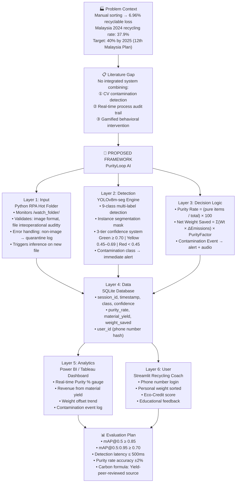
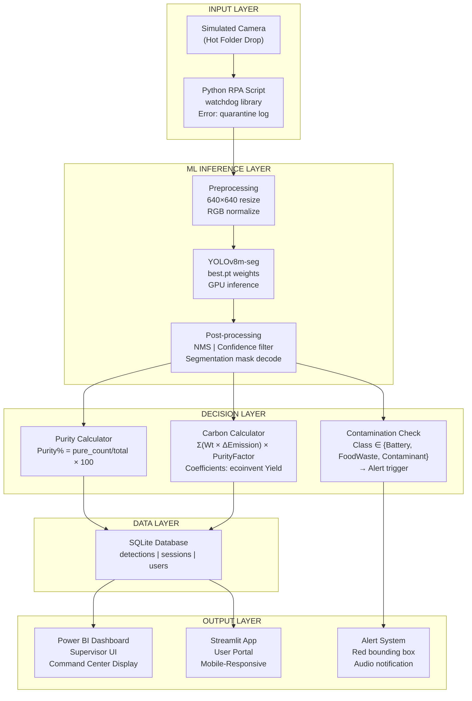
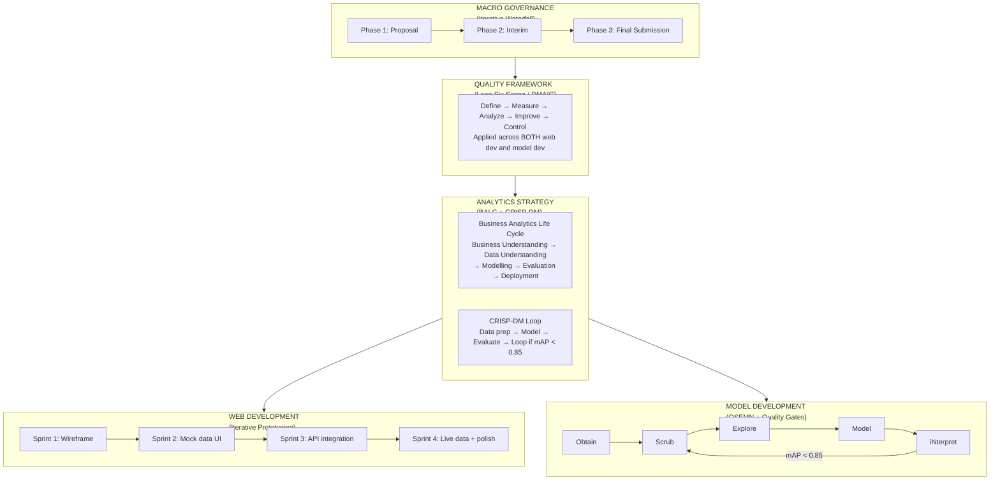
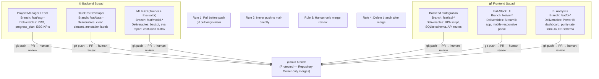
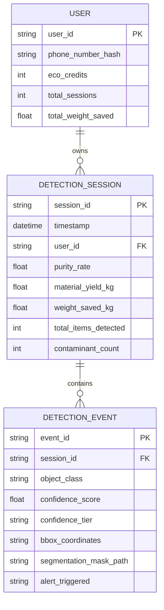

# PurityLoop AI — Framework Diagrams
**Version 1.0** | Capstone AY2025/26 | Sunway Business School — Business Analytics

---

## Fig 1 — PurityLoop Conceptual Framework
*Modelled after Narishah et al. (2022) SVRA-ERP framework structure*

---

## Fig 2 — DMAIC Quality Framework Mapping

```mermaid
flowchart LR
    subgraph D["DEFINE"]
        D1["Problem:\nRecycling contamination\ncauses 6.96% material loss\nin Malaysia annually"]
        D2["Scope:\n9 waste classes\nSimulated conveyor belt\n6-person team\nWW12 showcase target"]
    end

    subgraph M["MEASURE"]
        M1["Baseline:\nManual sorting error rate\n30–40% (literature)"]
        M2["Dataset KPIs:\n• Total images post-clean\n• Class distribution balance\n• Human annotation error rate"]
    end

    subgraph A["ANALYZE"]
        A1["Why YOLOv8m-seg?\n• vs EfficientDet: slower inference\n• vs ResNet: no segmentation mask\n• vs YOLOv8n: higher recall on small items\n• Anchor-free: adapts to irregular waste shape"]
        A2["Why multi-dataset fusion?\n• No single dataset covers Battery class\n  + recyclables + organic contaminants\n• TACO: real-world diversity\n• GC-V2: hazardous class coverage"]
    end

    subgraph I["IMPROVE"]
        I1["PurityLoop System\n(see Fig 1 framework)"]
        I2["10-Phase Training Pipeline\n(see Fig 5)"]
        I3["MLOps Quality Gates\n(see Fig 5)"]
    end

    subgraph C["CONTROL"]
        C1["KPI Dashboard\n• mAP tracked per epoch\n• Purity rate logged per session\n• Weight formula audited vs Yield source"]
        C2["Active Learning Loop\n• Low-confidence predictions → human review\n• Quarterly model retraining\n• Version control via Git tags"]
    end

    D --> M --> A --> I --> C
```

---

## Fig 3 — System Architecture (Technical)

---

## Fig 4 — Integrated Methodology Framework

---

## Fig 5 — Model Development Pipeline (10 Phases)

```mermaid
flowchart TD
    P0["Phase 0: Become One with Data\nManual data inspection\nManual inspect 100 images per class\nFind biases, corrupted labels, annotation errors\nRecord human error rate baseline"]

    P1["Phase 1: Dataset Acquisition\n11 datasets evaluated\n4 primary selected for fusion\nCriteria: battery class coverage + diversity"]

    P2["Phase 2: Data Cleaning\nRemove duplicates, corrupted files\nImage-to-label verification\nAnnotation inteoperational auditty check"]

    P3["Phase 3: Preprocessing\nResize → 640×640\nRGB normalization\nClass rebalancing via weighting"]

    P4["Phase 4: Annotation\nRoboflow Label Assist\n100% manual verification for seed set\nAuto-labelling for scale (10–20% spot check)"]

    P5["Phase 5: Augmentation\nRotation 90°, Horizontal flip\nBrightness ×1.2, Gaussian blur 2.5px\n4× multiplier (FID-validated)"]

    P6["Phase 6: Overfit-One-Batch Test\nData/Code Sanity Check\n2 images, near-zero loss required\nFail → debug coordinates/loading code\nDo NOT proceed to full training if fail"]

    P7["Phase 7: Diagnostic Training\n50 epochs, small batch\nVerify loss @ init: expected -ln(1/9) ≈ 2.20\nMonitor train_batch0.jpg\nInput-independent baseline test"]

    P8["Phase 8: Master Training\nYOLOv8m-seg, 300 epochs\nBatch=16, imgsz=640\nSeed=42 fixed\nEarly stopping on val/seg loss"]

    P9["Phase 9: Evaluation\nmAP@0.5 | mAP@0.5:0.95 | F1\nGeneralization held-out set\nConfusion matrix per class\nLatency benchmark (FPS)"]

    P10["Phase 10: Control\nActive learning: low-confidence → review queue\nVersioned weights via Git tags\nRetrain trigger: mAP drift > 3% from baseline"]

    P0 --> P1 --> P2 --> P3 --> P4 --> P5 --> P6 --> P7 --> P8 --> P9 --> P10
    P9 -->|"mAP@0.5 < 0.85"| P2
```

---

## Fig 6 — Team Structure & Git Protocol

---

## Fig 7 — Variable Matrix (Formal Specification)

