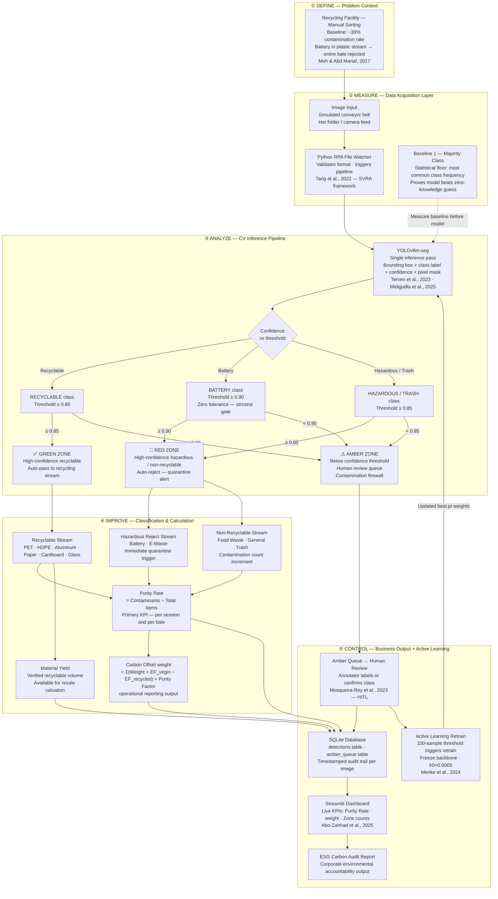
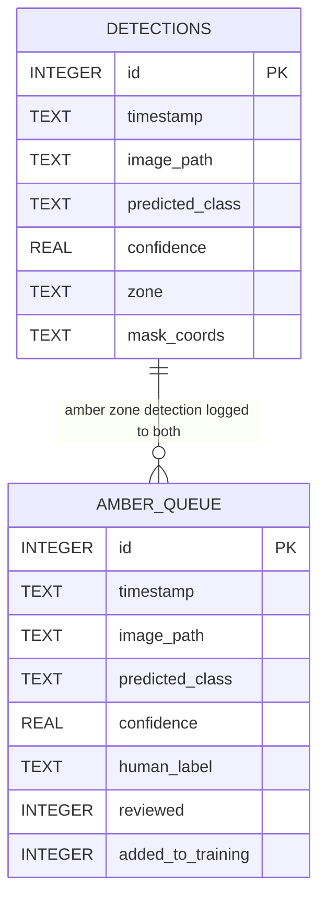

# PurityLoop AI — Mermaid Diagrams v2
### Framework Architecture + Project Lifecycle
**Version:** 2.0 | **Updated:** 2026-05-15
**Aligned to:** DMAIC · SVRA · Dr. Narishah requirements

---

## Diagram 1 — System Framework Architecture

> DMAIC-aligned. Shows 5 layers: Data Acquisition → CV Inference → Routing Logic → Business Output → Active Learning Loop.
> Updated for v7: single YOLOv8m-seg model (replaces 2-stage detection + segmentation).
> Mirrors Tang et al. (2022) SVRA framework structure: Problem → Framework → Components → Validation.



---

### Framework Layer Summary

| Layer | DMAIC | Component | Key Citation |
|-------|-------|-----------|-------------|
| Problem Context | Define | Manual sorting failure · contamination baseline | Moh & Abd Manaf, 2017 |
| Data Acquisition | Measure | RPA file watcher · hot folder ingestion | Tang et al., 2022 |
| CV Inference | Analyze | YOLOv8m-seg single-pass inference | Terven et al., 2023 |
| 3-Zone Routing | Analyze | Green / Amber / Red confidence gate | Midigudla et al., 2025 |
| Classification & KPIs | Improve | Purity Rate · weight · Material Yield | Midigudla et al., 2025 |
| Business Output | Control | SQLite · Streamlit · ESG Report | Abo-Zahhad et al., 2025 |
| Active Learning | Control | Amber queue → retrain loop | Menke et al., 2024 · Mosqueira-Rey et al., 2023 |

### Point of Integration (POI)

```
[Image Upload / Hot Folder]
         ↓
[Streamlit Frontend — app.py]
         ↓
[YOLOv8m-seg Inference Engine] ← best.pt loaded here  ← POI
         ↓
[3-Zone Routing Logic — routing.py]
    ↙         ↓         ↘
[GREEN]    [AMBER]     [RED]
            ↓
[amber_queue table] → Human review
         ↓
[SQLite Logger — detections table]
         ↓
[Dashboard Output — Streamlit ESG panel]
```

---

## Diagram 2 — Project / Product Lifecycle (10-Phase Pipeline)

> Maps model development from raw data collection to live deployment and active learning.
> Each phase = discrete quality gate. Failure = loop back, not forward progress.
> Aligns to DMAIC: Phases 1–5 = Measure/Analyze · Phases 6–8 = Improve · Phases 9–10 = Control.

```mermaid
flowchart TD

    START(["🟢 Start\nRaw images collected\nPer-person slice assigned"])

    subgraph PHASE12["Phases 1–2 — Data Foundation"]
        P1["Phase 1: Data Preprocessing\n• Perceptual hash deduplication\n• File format validation\n• Resolution check ≥ 640px\n• Per-person slice isolation"]
        P2["Phase 2: SAM Annotation\n• Kirillov et al., 2023 — zero-shot masks\n• COCO JSON → YOLOv8 label convert\n• 9-class taxonomy applied\n• Mask IoU inter-annotator check"]
    end

    P2_GATE{"Mask IoU > 0.75\nacross 30 matched samples?"}
    P2_FAIL["Re-annotate flagged instances\nAlign on edge cases"]

    subgraph PHASE3["Phase 3 — Individual Diagnostic Training"]
        P3["Phase 3: Per-Person Diagnostic Run\n• yolov8m-seg.pt pretrained base\n• 50 epochs · own slice only\n• Goal: surface label bugs per person\n• Export per-person CSV for Cleanlab\n• QC gate only — NOT final model"]
    end

    P3_GATE{"Per-class AP ≥ 0.60\nfor all 9 classes?"}
    P3_FAIL["Fix label bugs\nRe-annotate failing class(es)\nRe-run Phase 3"]

    subgraph PHASE45["Phases 4–5 — Quality Audit"]
        P4["Phase 4: HITL Quality Gate\n• Cross-team annotation comparison\n• Inter-annotator agreement > 85%\n• Mask IoU mean > 0.75 target\n• Mosqueira-Rey et al., 2023"]
        P5["Phase 5: Cleanlab Audit\n• Confident Learning — Northcutt et al., 2021\n• Input: per-person probability CSVs\n• Output: flagged mislabelled images\n• Fix or remove before merge"]
    end

    P4_GATE{"Agreement > 85%?"}
    P4_FAIL["Re-label disputed samples\nClarify label guide edge cases"]

    subgraph PHASE6["Phase 6 — Data Merge + EDA"]
        P6["Phase 6: Data Merge + EDA\n• Combine all 3 person slices\n• pHash dedup on combined pool\n• Single 80/20 train/val split\n• Per-class distribution bar chart\n• Recompute Baseline 1 from merged pool\n• Data leakage check: 0 duplicates train↔val"]
    end

    subgraph PHASE7["Phase 7 — Baseline 2"]
        P7["Phase 7: Initial Model — Baseline 2\n• 100 epochs · default params · no tuning\n• yolov8m-seg.pt pretrained weights\n• Record: mAP50 · mAP50-95 · Mask mAP50-M\n• This is the benchmark floor for all tuning runs\n• Must beat Baseline 1 and individual diagnostic models"]
    end

    subgraph PHASE8["Phase 8 — Master Training"]
        P8["Phase 8: Master Training + Hyperparameter Tuning\n• 300 epochs · patience=50\n• ONE parameter changed per run\n• Record all runs in comparison table\n• Tune order: imgsz → cls → copy_paste → degrees\n• Final config = highest val mAP run"]
        P8_NOTE["Comparison Table\nBaseline 2 vs each tuned run\nmAP50 · Precision · Recall · F1\nReport all — not just the winner"]
    end

    subgraph PHASE9["Phase 9 — Generalization Test"]
        P9_TEST["Phase 9: Generalization Testing\n• 100 images quarantined from Phase 1\n• Labelled but excluded from training\n• Run model.val() on showcase environment\n• Record: Val mAP vs Showcase mAP"]
        P9_JUDGE{"Generalization gap?"}
        P9_SUSPICIOUS["Gap < 5%\n⚠️ Suspicious — check for leakage\nVerify quarantine was clean"]
        P9_PASS["Gap 5–10%\n✅ PASS — Normal distribution shift\nDeploy best.pt"]
        P9_FAIL["Gap > 10%\n❌ FAIL — Training data mismatch\nProceed to Active Learning"]
    end

    subgraph PHASE10["Phase 10 — Active Learning Retrain"]
        P10["Phase 10: Active Learning Retrain\n• Start from master best.pt\n• Freeze backbone layers\n• lr0=0.0005 — conservative update\n• Add showcase-environment labelled images\n• Retrain · re-evaluate · repeat Phase 9\n• Menke et al., 2024"]
    end

    subgraph DEPLOY["Deployment"]
        DEP["Deploy to Showcase\n• Streamlit app + SQLite\n• ONNX export for CPU-only machines\n• Battery threshold hardcoded: 0.90\n• Pre-showcase checklist complete\n• Report both Val mAP and Showcase mAP\n  — hiding the gap = academic dishonesty"]
    end

    START --> P1
    P1 --> P2
    P2 --> P2_GATE
    P2_GATE -->|"FAIL"| P2_FAIL
    P2_FAIL --> P2
    P2_GATE -->|"PASS"| P3
    P3 --> P3_GATE
    P3_GATE -->|"FAIL — re-label"| P3_FAIL
    P3_FAIL --> P2
    P3_GATE -->|"PASS"| P4
    P4 --> P4_GATE
    P4_GATE -->|"FAIL"| P4_FAIL
    P4_FAIL --> P2
    P4_GATE -->|"PASS"| P5
    P5 --> P6
    P6 --> P7
    P7 --> P8
    P8 --> P8_NOTE
    P8_NOTE --> P9_TEST
    P9_TEST --> P9_JUDGE
    P9_JUDGE -->|"< 5% — check leakage"| P9_SUSPICIOUS
    P9_JUDGE -->|"5–10%"| P9_PASS
    P9_JUDGE -->|"> 10%"| P9_FAIL
    P9_SUSPICIOUS --> P9_PASS
    P9_PASS --> DEP
    P9_FAIL --> P10
    P10 --> P9_TEST
```



---

### Phase Summary Table

| Phase | DMAIC | Gate | Fail Action |
|-------|-------|------|-------------|
| 1 — Preprocessing | Measure | Format + dedup pass | Remove invalid files |
| 2 — SAM Annotation | Measure | Mask IoU > 0.75 | Re-annotate flagged |
| 3 — Diagnostic Training | Measure | Per-class AP ≥ 0.60 | Re-label + re-run |
| 4 — HITL Quality Gate | Measure | Agreement > 85% | Re-label disputed |
| 5 — Cleanlab Audit | Analyze | Flagged errors resolved | Fix or remove |
| 6 — Data Merge + EDA | Analyze | 0 leakage · clean split | Fix split |
| 7 — Baseline 2 | Analyze | Record mAP floor | — |
| 8 — Master Training | Improve | Max mAP tuned config | Tune more params |
| 9 — Generalization Test | Control | Gap 5–10% | → Phase 10 if >10% |
| 10 — Active Learning | Control | Re-test after retrain | Repeat until gap < 10% |

### Baselines Summary

| Baseline | What it is | Beats it → proves |
|----------|-----------|-------------------|
| B1 — Majority Class | Predict most frequent class always. Zero model. | Model learned something real, not just class frequency |
| B2 — Initial Model | YOLOv8m-seg on merged data, no tuning, 100 epochs | Fine-tuning added domain-specific value over naive pretrained weights |
| B3 — Individual Models | Each person's Phase 3 diagnostic run mAP | Merging all slices improved over any single person's data alone |

---

## Diagram 3 — DB Schema

> Required deliverable per Dr. Narishah session notes.



```sql
-- detections: all inference outputs
CREATE TABLE IF NOT EXISTS detections (
    id              INTEGER PRIMARY KEY AUTOINCREMENT,
    timestamp       TEXT,
    image_path      TEXT,
    predicted_class TEXT,
    confidence      REAL,
    zone            TEXT,        -- 'green' | 'amber' | 'red'
    mask_coords     TEXT         -- JSON polygon normalised coords
);

-- amber_queue: uncertain detections awaiting human label
CREATE TABLE IF NOT EXISTS amber_queue (
    id                  INTEGER PRIMARY KEY AUTOINCREMENT,
    timestamp           TEXT,
    image_path          TEXT,
    predicted_class     TEXT,
    confidence          REAL,
    human_label         TEXT,        -- filled after human review
    reviewed            INTEGER DEFAULT 0,
    added_to_training   INTEGER DEFAULT 0
);
```

---

*PurityLoop AI Capstone | PurityLoop_Diagrams_v2.md | 2026-05-15*
*Diagrams: Framework Architecture · 10-Phase Lifecycle · DB Schema*
*Render in: VS Code Mermaid Preview · Mermaid.live · Obsidian*
